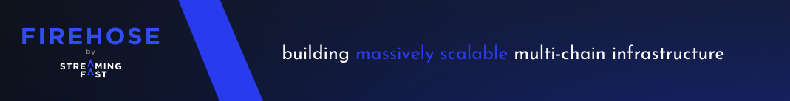

<a href="https://www.streamingfast.io/">
	
</a>

# Firehose for Cosmos chain

[](https://pkg.go.dev/github.com/streamingfast/firehose-vara)

Quick start with Firehose for Cosmos can be found in the official Firehose docs. Here some quick links to it:

- [Firehose Overview](https://firehose.streamingfast.io/introduction/firehose-overview)
- [Concepts & Architectures](https://firehose.streamingfast.io/concepts-and-architeceture)
  - [Components](https://firehose.streamingfast.io/concepts-and-architeceture/components)
  - [Data Flow](https://firehose.streamingfast.io/concepts-and-architeceture/data-flow)
  - [Data Storage](https://firehose.streamingfast.io/concepts-and-architeceture/data-storage)
  - [Design Principles](https://firehose.streamingfast.io/concepts-and-architeceture/design-principles)

# Block definition `cosmos/proto/sf/cosmos/type/v2/block.proto`

# Running the Firehose poller for Injective

```bash
fireinjective fetch {FIRST_STREAMABLE_BLOCK} --endpoints {VARA_RPC_ENDPOINT} --state-dir {STATE_DIR}
```

# Running the Firehose poller for Mantra

```bash
firemantra fetch {FIRST_STREAMABLE_BLOCK} --endpoints {VARA_RPC_ENDPOINT} --state-dir {STATE_DIR}
```

# Running the Firehose poller for injective

```bash
fireinjective fetch {FIRST_STREAMABLE_BLOCK} --endpoints {VARA_RPC_ENDPOINT} --state-dir {STATE_DIR}
```
